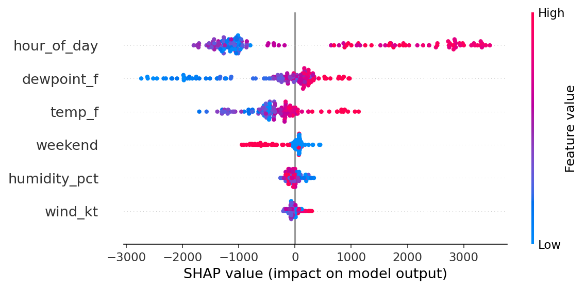
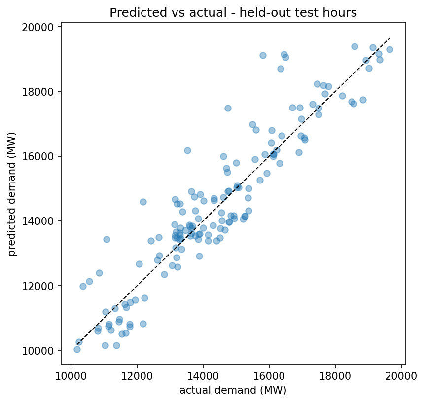

# Lab 2 report - explaining our demand model

**Authors:** _replace this line with your name_
<!-- ^ You and your partner BOTH edit THIS ONE LINE with your name, each on your own branch.
     When the second pull request merges you'll get a merge conflict right here - that's on
     purpose. Resolve it by keeping BOTH names. Everything else below is in separate sections,
     so those merge cleanly. -->

*Two people, one model, two kinds of explanation. Fill in YOUR section; leave your partner's alone.
Replace every `=>` with a real sentence; every number gets a unit.*

## Global - what the model leans on overall (Partner A)

=> hour_of_day is the model's top feature by a wide margin, followed by dewpoint_f and temp_f

=> hour_of_day. High values (afternoon/evening hours, shown in pink/red) push demand up.

## Local - one hour explained (Partner B)

=> Yes, the points track the diagonal closely, with a typical miss of around 662 MW

=> hour_of_day (+2,858 MW) and temp_f (+1,133 MW) pushed the prediction up the most. dewpoint_f and wind_kt pulled it down slightly.

## Combined (both, optional)

=> Time of day matters just as much as temperature when it comes to demand.

## What this explanation can't tell us
=> SHAP explains what this specific model learned from one summer's data in one region, it shows correlation the model relied on, not proof of what actually causes demand to rise.
